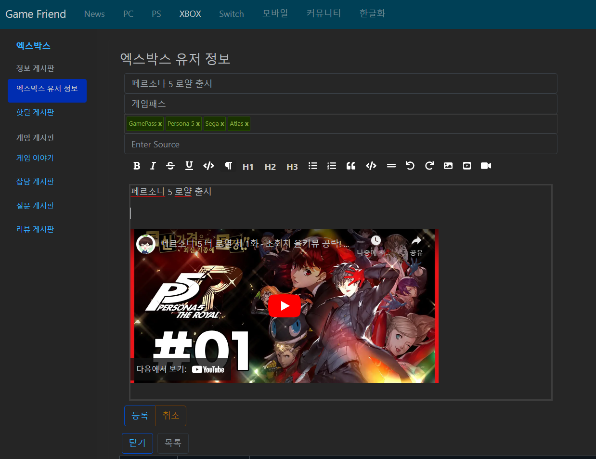
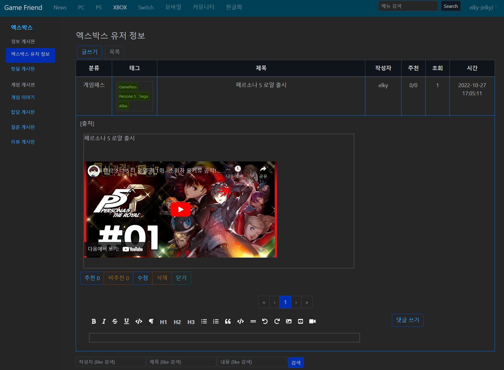

# WebCommunity

## introduce

### English

This is an example of a community site using ASP.NET, MongoDb, and Vue.js.

As MongoDB is shcemaless, it is implemented to create and operate collections dynamically.

Currently, all tables are dynamically created according to the URI, but it will be added to be dynamically created only according to the BoardDefinition data defined by the admin. (unimplemented state)

In the case of Frontend, the menu is configured based on the defined data, and the current configuration is defined based on the game community. 

### Korean

ASP.NET과 MongoDb, Vue.js를 이용한 커뮤니티 사이트 예시입니다.

MongoDB가 shcemaless 인 만큼, 동적으로 콜렉션을 생성해서 동작하게끔 구현되어있습니다.

현재는 URI에 따라 모든 테이블이 동적 생성되는데, Admin이 정의해둔 BoardDefinition 데이터에 따라서만 동적 생성되게 추가 예정입니다. (미구현 상태)

Frontend의 경우 정의된 데이터 기반으로 메뉴를 구성하게 되는데, 현재 구성은 게임 커뮤니티 기반으로 정의되어있습니다.

